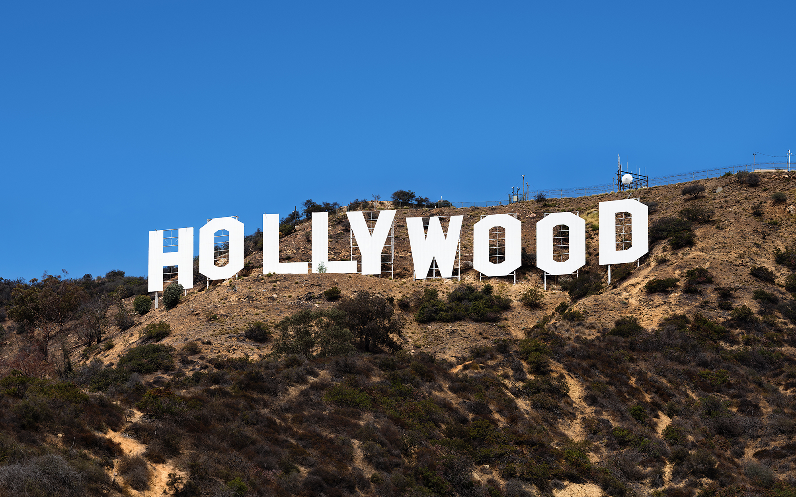
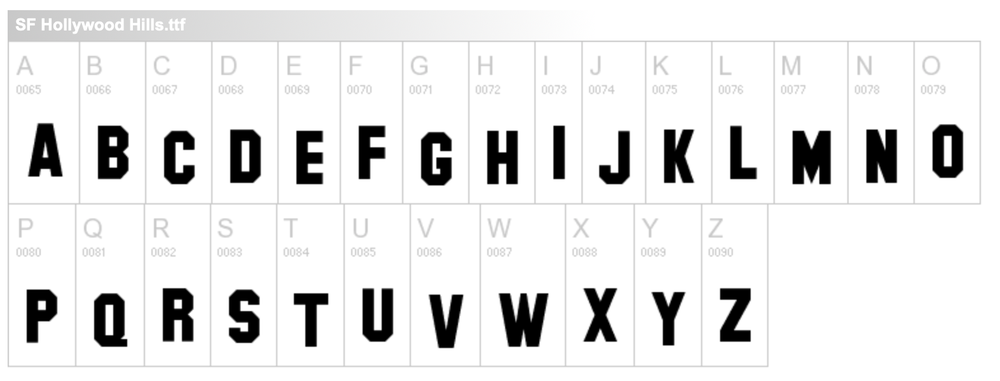

The Hollywood sign in Santa Monica, California is a well known landmark and has an interesting history, because it was originally put up in 1923 as an advertisement for land available for building homes in an area known as *Hollywoodland*.

The sign has gone through lots of changes over the years starting in 1949 when the 'land' part was removed. Originally the sign was created from 45 feet (14 metres)  high sheet metal and painted white. The letters were supported with poles and wires, but as you can see from the image in the banner on this page, this wasn't sturdy enough to protect against the strong winds that sometimes buffet these hills. Nowadays the letters are supported by very robust structures concreted into the ground.

In this view from above by Jonathan Gonzalez, we can see the supporting structures for the letters. We should be grateful, that there has never been an attempt to make the letters all sit at the same level; the slight unevenness of the ground is what makes the word distinctive and provides the charm.

## The Hollywood Font

The 45 ft letters are formed from a heavy sans serif font with distinctive angularity instead of curves. The 'O' (there are 3) and the 'D' have angles rather than curves and this may have been a practical way to cut the letters from sheet metal at that scale.

The typeface is similar to *[ITC Machine](http://www.identifont.com/find?font=Machine&q=Go)* designed by Ronne Bonder and Tom Carnase in 1970

A company called [ShyFonts](https://www.dafont.com/hollywood-hills.font) have created the SF Hollywood Hills font that simulated the variable baseline as seen in the real sign.

